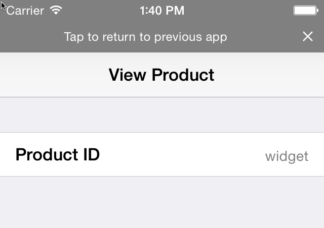

Rivets
-----

Rivets is a C# implementation of [App Links](http://applinks.org).  It's functionally a port of [Bolts](https://github.com/BoltsFramework/), the Java/Obj-C implementation.  Rivets is still in alpha and will be available on NuGet as a PCL when it is ready for its first release!
### What is/are App Links?
App Links are a new open source, cross-platform standard for helping link between Mobile and the Web (and vice-versa).

App Links are a defined set of metadata that can be advertised within html of web pages that specify how to deep link to content inside of a Mobile app.  

App Links are about the ***discovery*** of ways to link between Mobile and Web.

 - **Mobile Deep Linking from the Web** - Web pages can advertise special `<metadata ... />` tags within a normal web page, which specify how to deep link to content inside of a particular Mobile app.  
 - **Mobile to Mobile Linking** - Mobile apps can resolve meta data from Web links into links for other mobile apps.


### How does it work?

Let's say you have a link: `http://example.com/products/widget` which displays information about a Widget you can buy on the web.  

What if you also had a native Mobile app which could display this information?  How would you describe how to send users to it?  Most platforms have some means of 'deep-linking' inside of an app, but each platform does it a little bit differently.  

Using App Links, you can resolve what different mobile platform links are available for a given url.  For example, if you resolve the app links for the url mentioned above, you could find that the equivalent deep link url for the iOS app is actually: `example://products?id=widget` (as is specified by the `<metadata ... />` tags right within the web page's html).

### So what?
Well, in a closed eco-system of your own apps and websites, this might not sound like such a big deal, but what if you wanted to link to your Facebook or Google+ or other social page from your website?  You would have to research the format for deep linking each particular social platform and add these special links to your apps.  

Instead, using App Links, you can just resolve the web url for your Facebook page, and instead of sending users of your app to a web view of that page, you could resolve the deep link of your Facebook page and open it right inside the native Facebook app!  If the user doesn't have the app installed, you can still fall back to the web page.

### App Links Specification
The official documentation of App Links can currently be found here: [http://applinks.org/documentation/](http://applinks.org/documentation/)

To show you a simple example, this might be how you advertise App Links to your various mobile apps from your product page (the one we discussed above):

```html
<html>
<head>
	<!-- iOS -->
	<meta property="al:ios:url" content="example://products?id=widget" />
	<meta property="al:ios:app_name" content="Example Store" />
	<meta property="al:ios:app_store_id" content="12345" />
	
	<!-- Android -->
	<meta property="al:android:package" content="com.example" />
	<meta property="al:android:url" content="example://products?id=widget" />
	<meta property="al:android:app_name" content="Example Store" />

	<!-- Windows Phone -->
	<meta property="al:windows_phone:url" content="example://products?id=widget" />
	<meta property="al:windows_phone:app_name" content="Example Store" />
	<meta property="al:windows_phone:app_id" content="a14e93aa-27c7-df11-a844-00237de2db9f	" />
	
	<!-- Web Fallback -->
	<meta property="al:web:should_fallback" content="true" />
	<meta property="al:web:url" content="http://example.com/products/widget" />
</head>
</html>
```

### Using Rivets in your Apps

Using Rivets in your app is quite simple.  At the most basic level, you can just use the Navigator to automatically resolve App Link metadata from a url and navigate to it:

```csharp
var result = await AppLinks.Navigator.Navigate ("http://example.com/products/widget");
```

If you want to understand a bit more about what's going on under the hood, there are actually two steps.  The first step is using the default Resolver (In Rivets that would be `HttpClientAppLinksResolver` to go out and parse `<metadata .../>` from the given url.  If it finds any targets, it will try to navigate to the target which is the best match:

```csharp
var resolver = new HttpClientAppLinkResolver();
var appLinks = await resolver.ResolveAppLinks ("http://example.com/products/widget");

var navigator = new AppLinkNavigator();
var status = await navigator.Navigate(appLinks);

if (status == NavigationResult.App) {
   // Success! We navigated to another app
} else if (status == NavigationResult.Web) {
   // No app installed or no App found in AppLinks,
   //  so we should fall back to URL instead:
   webView.Load(appLinks.WebUrl);
} else {
	// Some other error occurred
}
```

### Parsing Incoming App Links

On iOS, when your app is launched by a URL, you will want to parse that URL to determine how to navigate to the deep link inside of your app.  You can use the `AppLinkUrl` class to help parse your links:

Don't forget on iOS you need to register the Url Scheme(s) you want your app to listen for in your `Info.plist` file!

```csharp
public virtual bool OpenUrl (UIApplication app, NSUrl url, string srcApp, NSObject annotation)
var alUrl = new AppLinkUrl(url.ToString());

var page = alUrl.TargetUrl.AbsolutePath;
var id = alUrl.TargetQueryParameters["id"];

// Navigate to the 'page' and pass the 'id'
if (page == "/products") {
	var productViewController = new ProductViewController {
		ProductId = id
	};
	NavigationController.PushViewController(productViewController, true);
}
```

On Android, first of all, we need to register an ***IntentFilter*** for our app to be eligible to receive Intents from the url scheme we want to listen for.

Then, in your Activity, you can parse the `Intent.Data` Uri using the `AppLinkUrl` class the same way we did in iOS:

```csharp
[Activity (Label = "Product")]			
[IntentFilter(new [] {Android.Content.Intent.ActionView }, 
	DataScheme="example", 
	DataHost="*", 
	Categories=new [] { Android.Content.Intent.CategoryDefault })]
public class ProductActivity : Activity
{
	protected override void OnCreate (Bundle bundle)
	{
		base.OnCreate (bundle);

		var id = string.Empty;

		// First, check if we started the task with an extra from our own app
		if (Intent.HasExtra ("PRODUCT_ID")) {
			id = Intent.GetStringExtra ("PRODUCT_ID");
		} else {
		
			// Parse our AppLinkUrl from the Intent Data Uri
			var alUrl = new Rivets.AppLinkUrl (Intent.Data.ToString ());

			if (alUrl != null && alUrl.TargetQueryParameters.ContainsKey ("id"))
				id = alUrl.TargetQueryParameters ["id"];
		}

		Toast.MakeText (this, "Display Product Id: " + id, ToastLength.Short).Show ();
	}
}
```

### Referrer Url's and going back to them

Luckily, on Android and Windows Phone, we don't really have to worry about the back state so much.  Both of these platforms have back button concepts.

However, on iOS, that's not the case, and we usually want to give the user the chance to go back to where they came from.  If we have navigated inside of our app from an App Link that launched us there, we should add some sort of UI for the user to navigate back to whatever launched us into the App Link.

For iOS, when you parse an incoming link, the `Referrer` property may have a value.  If it does, we should obey it and display something to a user that when pressed, will open the `Referrer` app link to return to that application.

App Links recommends showing the "Touch to Return" banner at the top of the screen on iOS.



In the Rivets assembly built specifically for iOS, there is a class called `RefererViewBar` that does not exist in any of the other platform specific libraries.  You can use this class to help you display a Touch to Return banner in your app:

```csharp

public override void ViewDidLoad ()
{
	base.ViewDidLoad ();

	refererViewBar = new Rivets.RefererViewBar (this);
	refererViewBar.OnClosedRefererOverlay += () => InvokeOnMainThread (() => {

		// Remove the Referer Overlay
		refererViewBar.Remove ();
	});
}
```


### HTTP Request Headers

One detail which will help with the performance of resolving App Links, is that all clients making web requests in an attempt to resolve App Links, should always send the request header:

```
Prefer-Html-Meta-Tags: al
```

If the server implements this feature, it will limit its response to only include the HTML containing the `<meta property="al:..." ... />` tags, instead of the normal, full text/html page.


## Learn More
You can learn more by visiting http://applinks.org


## License
The Apache License 2.0 applies to all samples in this repository.

Copyright 2013-2014 Jonathan Dick

Licensed under the Apache License, Version 2.0 (the "License"); you may not use this file except in compliance with the License. You may obtain a copy of the License at

   http://www.apache.org/licenses/LICENSE-2.0
   
Unless required by applicable law or agreed to in writing, software distributed under the License is distributed on an "AS IS" BASIS, WITHOUT WARRANTIES OR CONDITIONS OF ANY KIND, either express or implied. See the License for the specific language governing permissions and limitations under the License.
